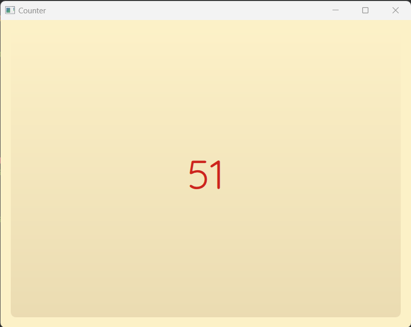

# Counter

GUI for a counter using QML



## Usage

**Press <Space> to increment the counter**

## Development

### Dependencies

- CMake 3.5+
- Qt 6.0.4+
- C++17 Compiler

### Build

```bash
cmake . -B build
cmake --build build
```

## Release

```bash
cmake . -B build
cmake --build build --config Release --target ALL_BUILD -j 10
```

## License

Licensed under the [MIT](LICENSE) License.
